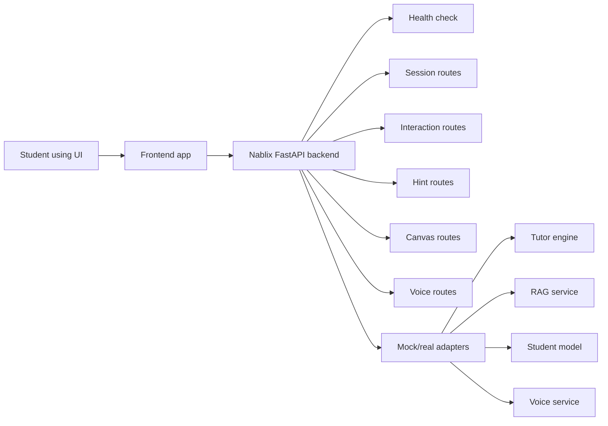
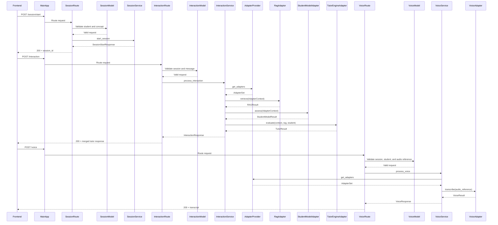
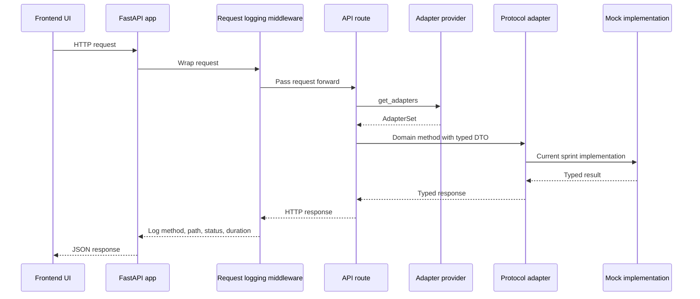
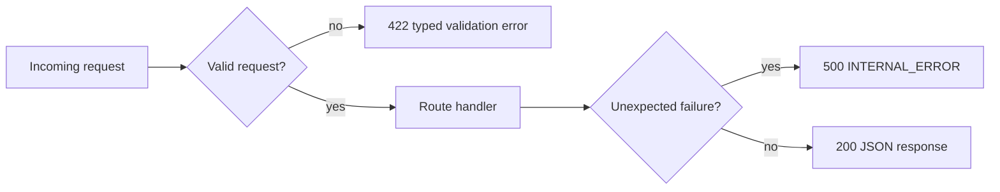

# Nablix AI Math Tutor API


Backend scaffold for the Nablix AI Math Tutor: a FastAPI service that receives student input, routes it through tutoring and learning-support services, and returns structured guidance.

The current repository is an early backend foundation. It has app wiring, config, logging, structured errors, mock adapters, and the first working session and interaction endpoints.

## What This Backend Does

The backend sits between the learning interface and the AI/service layer.

- The frontend sends session, text, canvas, hint, and voice events.
- FastAPI routes receive those requests.
- The backend validates inputs and records request logs.
- Service/adapters prepare calls to downstream systems.
- Mock mode returns realistic hardcoded responses until real services are ready.



## Architecture Diagram

A visual explainer of the backend request flow and adapter seam. The editable
source is [`docs/nablix-backend-explainer.excalidraw`](docs/nablix-backend-explainer.excalidraw);
the PNG below is the rendered export that GitHub displays.


## Repository Structure

```text
app/
  api/          HTTP route modules
  adapters/     boundaries for tutor, retrieval, student model, and voice services
  core/         config, logger, and custom exceptions
  middleware/   request logging
  models/       request/response model package placeholder
  services/     application service package placeholder
tests/          smoke-test package placeholder
```

## Request Flow

Editable FigJam diagram:

[Nablix Session and Interaction Request Flow](https://www.figma.com/board/pid9bp1xJxnIBvCl7eAa2w/Nablix-Session-and-Interaction-Request-Flow?node-id=0-1&p=f&t=pokroMI5YPf3x2zw-0)





## Current Endpoint Contract

| Method | Path | Purpose | Current status |
| --- | --- | --- | --- |
| `GET` | `/health` | Confirms the backend is running. | Implemented |
| `POST` | `/session/start` | Starts a mock session from `concept_id` + `interaction_mode`; returns diagnostic question plus UI/voice/canvas start state. | Implemented |
| `GET` | `/session/{session_id}` | Reads in-memory mock session state. | Implemented |
| `POST` | `/session/end` | Marks an in-memory mock session as ended. | Implemented |
| `POST` | `/interaction` | Sends a student interaction through mock RAG, student model, and tutor engine adapters; returns the session view. | Implemented |
| `POST` | `/hint/request` | Requests a generated hint for an active session in a hint-enabled phase. | Implemented |
| `POST` | `/canvas/submit` | Sends canvas work for mock submission. | Implemented |
| `POST` | `/voice/session/start` | Starts a mock voice stream for an existing session. | Implemented |
| `POST` | `/voice/transcript` | Routes a completed voice transcript through the tutor interaction flow. | Implemented |
| `POST` | `/voice` | Sends voice input for transcription. | Implemented |

FastAPI exposes generated OpenAPI docs at:

```text
http://127.0.0.1:8000/openapi.json
```

That generated file only shows routes that are implemented in code. The product-level API specification also explains intended behavior, validation rules, errors, and examples.

API specification:

- Google Doc: https://docs.google.com/document/d/1ldLwWdYZlFAlMHMlZa_yffyr5APPfF15_0Fql1VvPh8
- Notion: https://app.notion.com/p/3808b00a832581b388ccc56ca5857226

## Mock Adapter Design

Adapter flow diagram:

[Nablix Adapter Flow - Current Code](https://www.figma.com/board/s6llAypAFFMlpizbd93fwZ?utm_source=codex&utm_content=edit_in_figjam&oai_id=&request_id=7d204439-8dfc-4fb4-958e-9294703d7ceb)

The backend now uses typed adapter protocols and DTOs instead of raw dictionary
responses. Application services depend on protocol interfaces, while each
adapter decides from its `NABLIX_USE_MOCK_*` setting whether to return realistic
mock data or call its configured downstream service URL.

Current adapter changes:

- `POST /interaction` builds one typed `AdapterContext` and merges typed RAG,
  student-model, and tutor-engine results.
- `POST /voice` is implemented and routes voice requests through the voice
  adapter.
- `POST /hint/request` validates the active session, checks that hints are
  allowed in the stored phase, uses the stored hint count, records a student
  model hint event, increments session state, and returns the short hint shape.
- `AdapterSet` is the single provider return type for the active tutor, RAG,
  student-model, and voice adapters.
- The current implementations expose `call(...)`, `parse_response(...)`, and
  `handle_error(...)` behind their service-facing methods.
- `POST /session/start`, `GET /session/{session_id}`, and `POST /session/end`
  use an in-memory mock session registry. `/interaction` and `/hint/request`
  require an existing session owned by the student. `/voice` still consumes
  session-shaped IDs without checking that registry.

Configured adapters:

| Adapter protocol | Current implementation | Method |
| --- | --- | --- |
| `TutorEngineAdapter` | `TutorEngineServiceAdapter` | `evaluate(...)` |
| `RAGServiceAdapter` | `RAGServiceAdapterClient` | `retrieve(...)` |
| `StudentModelAdapter` | `StudentModelServiceAdapter` | `assess(...)` |
| `VoiceServiceAdapter` | `VoiceServiceAdapterClient` | `transcribe(...)` |

## Configuration

Runtime settings are read from environment variables with the `NABLIX_` prefix. Use `.env.example` as the template for local setup.

Important rule:

```text
.env is ignored and must not be committed.
.env.example is safe to commit.
```

Example:

```env
NABLIX_APP_NAME=Nablix AI Math Tutor API
NABLIX_DEBUG=false
NABLIX_USE_MOCK_RAG=true
NABLIX_USE_MOCK_STUDENT_MODEL=true
NABLIX_USE_MOCK_VOICE=true
NABLIX_ADAPTER_REQUEST_TIMEOUT_SECONDS=20
NABLIX_ADAPTER_REQUEST_RETRY_COUNT=2
```

## Local Development

Create a virtual environment:

```bash
python3 -m venv .venv
```

Install dependencies:

```bash
.venv/bin/pip install -r requirements.txt
```

Run the API:

```bash
.venv/bin/uvicorn app.main:app --reload
```

Open the API docs:

```text
http://127.0.0.1:8000/docs
```

Check health:

```bash
curl http://127.0.0.1:8000/health
```

Expected shape:

```json
{
  "status": "healthy",
  "app": "Nablix AI Math Tutor API",
  "version": "1.0.0",
  "timestamp": "2026-06-18T10:00:00.000000+00:00",
  "mode": "mock"
}
```

## Error Handling

The app returns structured JSON errors instead of Python tracebacks.



Common error shape:

```json
{
  "error_code": "INVALID_FORMAT",
  "message": "student_id must follow the format ST followed by three digits.",
  "field": "student_id",
  "timestamp": "2026-06-15T10:00:00Z",
  "request_id": "REQ001"
}
```

Validation errors use specific `error_code` values such as `MISSING_FIELD`,
`INVALID_FORMAT`, `INVALID_VALUE`, `INPUT_TOO_LONG`, and `INVALID_JSON`.

## Logging

Every request passes through middleware that logs:

- HTTP method
- request path
- response status code
- request duration

Example line:

```text
method=GET path=/health status_code=200 duration=0.003s
```

## Version Control

Nablix repositories follow the shared organization guidelines:

- Branch from `main`.
- Use typed branch names, such as `feat/backend-api-scaffold`.
- Use Conventional Commits.
- Keep `.env` and secrets out of Git.
- Open pull requests into `main`.
- Squash and merge after review.

Example commit:

```bash
git commit -m "feat(api): add backend scaffold"
```

## Current Limitations

- All currently planned mock routes are registered and covered by smoke tests.
- The session registry is in-memory only, per process, and resets on reload.
- `/interaction` and `/voice` validate session ID format but do not yet verify session existence.
- Mock adapters return hardcoded responses; real service calls depend on configured service URLs.
- No database or persistent session storage exists yet.

## Next Engineering Steps

1. Decide whether adapter debug fields should stay in `/interaction` responses or move behind a debug mode.
2. Decide when `/interaction` and `/voice` should require a stored active session.
3. Add persistence when session state needs to survive reloads or multiple workers.
4. Replace mock adapter responses with real service calls as downstream services become available.
5. Add real canvas analysis when the downstream service contract exists.
